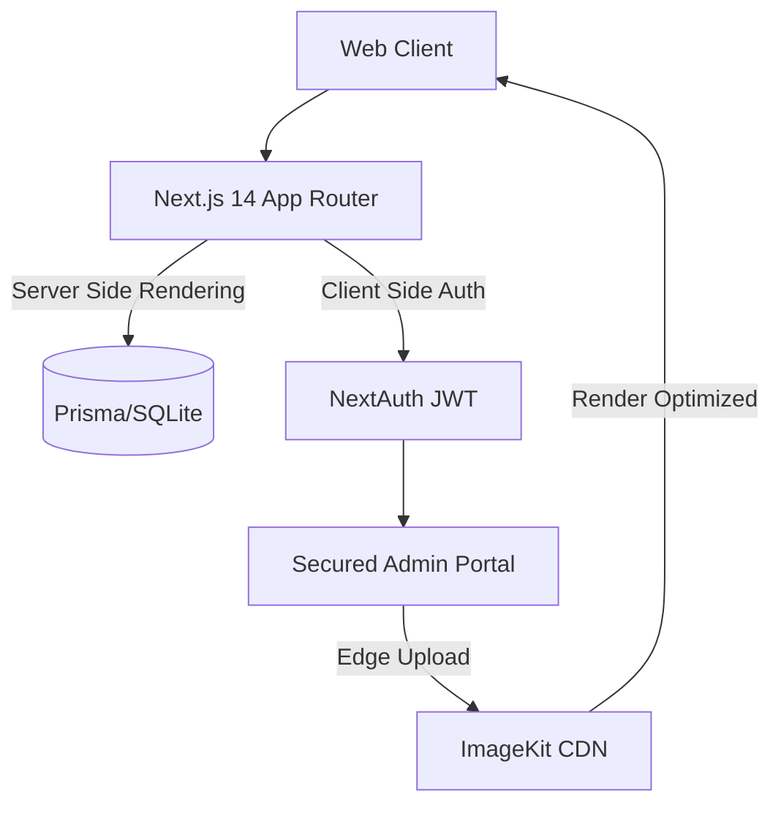

<div align="center">
  <h1>📸 Civilisation AI: Photography Portfolio</h1>
  <p><i>A hyper-dynamic, high-performance portfolio application.</i></p>

  <p>
    <a href="#architecture">Architecture</a> •
    <a href="#features">Features</a> •
    <a href="#technologies-used">Technologies Used</a> •
    <a href="#local-setup">Local Setup</a>
  </p>
</div>


## Architecture

This application employs a modern JAMStack approach tailored for high-fidelity media delivery and stringent private administration. 



## Features
- **Dynamic Layout Algorithms**: Utilizes `@chenglou/pretext` for pixel-perfect, intelligent typography wrapping across screens, avoiding standard DOM layout issues.
- **Secured Content Pipeline**: An exclusive authenticated portal ensures only the designated administrator can upload, tag, and modify feature sections via `next-auth`.
- **CDN-Backed Media**: Images drop perfectly into ImageKit's dedicated global network, ensuring lossy vs lossless image transitions happen transparently. 
- **Type-Safe ORM Logging**: A rigid database mapping managed by `Prisma` to categorize content dynamically based on visual themes (e.g., Weddings, Portraits, Fashion).

## Technologies Used
- **Framework:** `Next.js 14` (App Router) with React 18
- **UI:** `TailwindCSS` with `lucide-react` icons and custom `pretext` components. 
- **Database & Auth:** `Prisma ORM`, `SQLite`, `NextAuth.js`.
- **Media Optimization:** `ImageKit.io` Edge CDN.

## Local Setup

**1. Clone Repo & Install Packages**
```bash
git clone https://github.com/kunal-gh/photography-portfolio-showcase.git
cd photography-portfolio-showcase
npm install
```

**2. Configure Environment Files**
You must create an `.env.local` file with the exact configuration properties required. 
```ini
NEXT_PUBLIC_IMAGEKIT_URL_ENDPOINT="https://ik.imagekit.io/<your_id>"
NEXT_PUBLIC_IMAGEKIT_PUBLIC_KEY="public_..."
IMAGEKIT_PRIVATE_KEY="private_..."
NEXTAUTH_URL="http://localhost:3000"
NEXTAUTH_SECRET="your_secret_key"
ADMIN_USERNAME="admin"
ADMIN_PASSWORD="secure_password"
POSTGRES_PRISMA_URL="postgres://default:..."
POSTGRES_URL_NON_POOLING="postgres://default:..."
```

**3. Database Hydration**
```bash
npx prisma generate
npx prisma db push
```

**4. Start Edge Server**
```bash
npm run dev
```
Navigate to `http://localhost:3000/admin/login` to manage content, or `http://localhost:3000/` to test dynamic capabilities.
