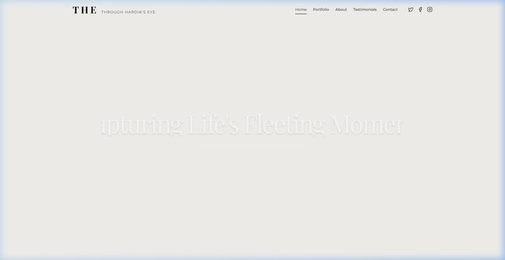
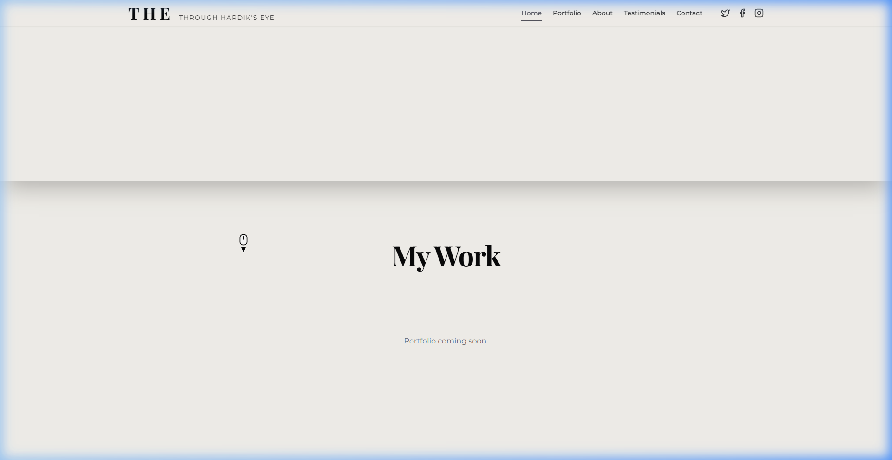
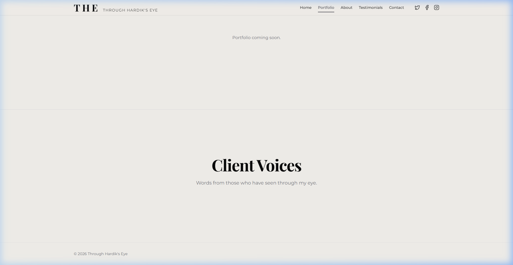
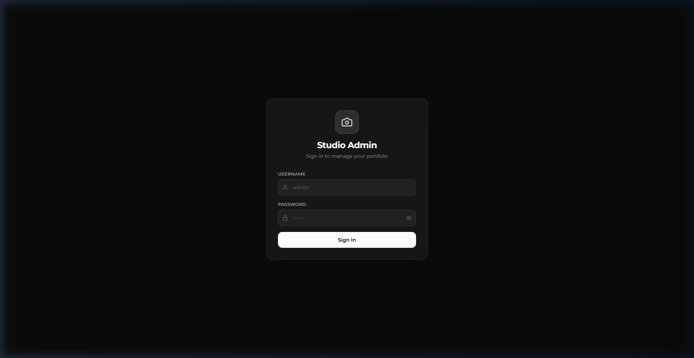

# Photopholio — Web Engineering Showcase 📸

> A production-grade photography portfolio engineered to demonstrate elite front-end mechanics, serverless data pipelines, fluid typography, and dynamic CMS architecture — all live at [photopholio-omega.vercel.app](https://photopholio-omega.vercel.app/).

---

## 📸 Live Screenshots

### Homepage — Cinematic Hero

### Portfolio Grid — Adaptive Editorial Layout

### Footer

### Admin Portal — Secure Dark Mode Dashboard

---

## ✨ Engineering Vision

Modern web applications suffer from sluggish DOM re-flows, layout shifts (CLS), and rigid, uninspired aesthetics. This application was built to challenge those norms — operating at the intersection of complex typography mathematics, serverless data pipelines, and fluid responsive design.

---

## 🚀 Typography & Cinematic Animations

Traditional responsive web typography relies on brittle `vw` math or rigid breakpoints.

**The Solution:** This application leverages CSS `text-wrap: balance`, native line-height optics, and programmatic staggered React delays. It achieves mathematically perfect text-wrapping locally on the user's browser, bypassing heavy layout miscalculations.

It pairs this fluid typography with a **Focal-Pull Animation System** on the hero images: an ultra-premium visual transition used by luxury brands to simulate camera-lens depth-of-field movement, un-blurring and scaling the image dynamically as it locks into focus.

---

## 🛠 Core Tech Stack

| Layer | Technology | Purpose |
|---|---|---|
| **Framework** | Next.js 14 (App Router) | SSR + SSG, edge routing, file-based API |
| **Database** | Vercel Postgres + Prisma ORM | Type-safe serverless queries |
| **Media CDN** | ImageKit.io | On-the-fly WebP/AVIF, edge caching |
| **Typography/Animation**| Native CSS + React | `text-wrap: balance` & Focal-pull algorithms |
| **Auth** | next-auth v4 + Edge Middleware | JWT session, server-side route protection |
| **Styling** | TailwindCSS + Shadcn UI | Token-based CSS, glassmorphism effects |
| **Third-Party APIs**| Google Drive API | Direct OAuth Client-to-ImageKit bulk uploads |

---

## 🏗 Key Architecture Features

### Dynamic CMS — Admin Portal
A fully dark-mode, secure admin portal accessible at `/admin`:
- **Section Manager** — add, rename, delete photography sections; the public grid auto-adapts its mosaic layout to match
- **Photo Upload** — metadata-rich uploads (title, section, tags, event date, featured flag) via ImageKit CDN
- **Contact Inbox** — view messages from the contact form
- **Archive System** — deleted sections move photos to archive instead of destroying them
- **Edge Auth** — NextAuth middleware blocks unauthenticated dashboard requests before the page renders

### Google Drive Cloud Integration
Within the CMS dashboard, the image ingestion pipeline is fused directly with a custom **Google Drive API Picker**. 
Instead of downloading gigabytes of photo exports and locally uploading them to the server, admins connect via an OAuth popup and stream multi-megabyte visual assets *directly* from their Google Drive Cloud to the ImageKit CDN.

### Intelligent Navigation Routing
Single-page anchor navigation (e.g., `#portfolio`) inherently litters UX history states and creates ugly URLs. 
This application features a sophisticated anchor-intercept wrapper that actively bypasses the restrictive Next.js memory router. It executes smooth programmatic DOM scrolls with custom `y-axis` layout offsets ensuring fixed navigation bars never obscure titles, while completely sanitizing the URL.

### Adaptive Portfolio Grid
The frontend grid uses an **algorithmic layout engine** that reshapes itself based on section count:
- 1–2 sections → full-width editorial rows
- 3–4 sections → balanced wide/narrow split
- 5–6 sections → cinema-scale mosaic (flagship look)
- 7+ sections → clean uniform 3-column grid

### Glassmorphism Navigation
The header transitions from fully transparent at the top of the page to a live `backdrop-blur` translucent glass effect as the user scrolls — implemented via a scroll event listener and Tailwind conditional classes.

---

## 📱 Mobile Architecture
A custom masonry grid hook intercepts the client window object, dynamically degrading complex grid alignments into a thumb-accessible flow for localized touch targets. Instead of hiding desktop complexity, the layout is mathematically reconstructed per device.

---

*Developed as a strict display of modern full-stack web capabilities, layout mathematics, and edge computing.*
